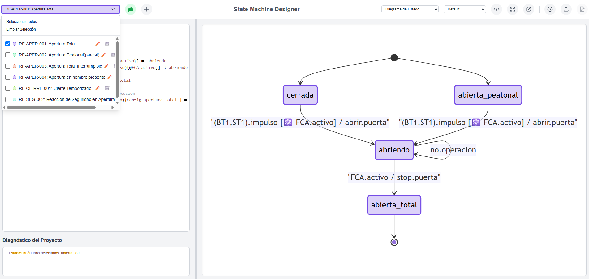

Claro, aquí tienes el contenido del documento convertido a un formato Markdown ideal para un `README.md` en GitHub.

-----

# Lenguaje de Definición de Máquinas de Estado (LDME)

*Versión: 1.0 (14 de octubre de 2025)*

Este repositorio contiene la especificación para el **Lenguaje de Definición de Máquinas de Estado (LDME)**, un Lenguaje Específico de Dominio (DSL) diseñado para describir de forma inequívoca, legible y robusta el comportamiento de sistemas reactivos complejos. Su objetivo es eliminar ambigüedades en la ejecución de transiciones, especialmente en escenarios con concurrencia y eventos de alta prioridad.

La aplicación de demostración es accesible desde [este enlace](https://diegomguillen.github.io/statemachinedefinitionlanguage/). 

-----

## Sintaxis Fundamental

Toda transición se define mediante una única línea que sigue una estructura fundamental y clara:

```plaintext
Estado_Origen ⇒ [Cuerpo_de_la_Transición] ⇒ Estado_Destino
```

| Componente | Símbolo | Descripción |
| :--- | :---: | :--- |
| **Estado de Origen** | `nombre_estado` | [cite\_start]El estado en el que se encuentra el sistema antes de la transición. |
| **Operador de Transición** | `⇒` | [cite\_start]Indica un cambio de estado.|
| **Cuerpo de la Transición**| `[...]` | [cite\_start]Encapsula toda la lógica (acción, disparador, guarda). |
| **Estado de Destino** | `nombre_estado` | [cite\_start]El estado al que pasa el sistema si la transición se completa. |

-----

## Componentes Detallados

El `Cuerpo_de_la_Transición` se desglosa en tres componentes principales:

```plaintext
[accion.objeto(Disparador){Guarda}]
```

  * **`accion.objeto`**: La operación a ejecutar. [cite\_start]Se compone del objeto afectado y la acción a realizar (ej: `motor.abrir`).
  * **`(Disparador)`**: El evento o conjunto de eventos que activan la evaluación de la transición.
  * **`{Guarda}`**: Una condición booleana (opcional) que debe ser verdadera para que la transición se ejecute.

-----

## Modificadores Opcionales de Comportamiento

Para gestionar escenarios de alta prioridad y de concurrencia, se pueden aplicar los modificadores `!` y `@`.

### Modificador de Interrupción (`!`)

El prefijo `!` marca una transición como una **acción de seguridad o interrupción**.

  * **Uso**: Se antepone a la `accion.objeto`.
    ```plaintext
    [!motor.abrir(...)]
    ```
  * **Comportamiento**: Otorga la **máxima prioridad** a la transición, permitiéndole interrumpir cualquier otra operación normal del sistema.Es ideal para gestionar eventos críticos como paradas de emergencia o alarmas.

### Modificador de Atomicidad (`@`)

El prefijo `@` marca una guarda como **atómica**, garantizando que la operación sea indivisible.

  * **Uso**: Se antepone a la condición, dentro de las llaves.
    ```plaintext
    {@condicion}
    ```
  * **Comportamiento**: Previene **condiciones de carrera** (*race conditions*) al asegurar que la "comprobación de la guarda y la ejecución de la acción" se realicen como un bloque único e indivisible. Esto es crucial cuando múltiples procesos intentan acceder a un recurso compartido y limitado.

#### Comparativa: Guarda Estándar vs. Atómica

  * **Guarda Estándar `{condicion}` (No Atómica)**
    Se utiliza para validaciones simples donde el riesgo de concurrencia es nulo.

      * **Ejemplo**: Bloquear una puerta una vez que ya está cerrada.La operación es iniciada por un único comando y el estado `cerrada` es estable.
        ```plaintext
        cerrada ⇒ [cerrojo.bloquear(usuario.comando_bloquear){puerta.estado == 'cerrada'}] ⇒ puerta_bloqueada
        ```

  * **Guarda Atómica `{@condicion}` (Atómica)**
    Se utiliza para gestionar un recurso compartido y limitado, como las plazas de un parking.

      * **Ejemplo**: Evitar que dos coches ocupen la última plaza VIP disponible. El modificador `@` garantiza que la comprobación de plazas libres y la asignación de la plaza sean una operación indivisible. El primer proceso que accede "bloquea" el recurso, evitando que el segundo lo utilice.
        ```plaintext
        barrera_cerrada ⇒ [motor.abrir(sensor.ticket_vip_leido){@servidor_parking.plazas_vip > 0}] ⇒ barrera_abriendo
        ```

-----

## Operadores Lógicos para Disparadores

Un disparador puede ser un evento único o una combinación lógica de varios eventos:

  * **Operador OR (`,`)**: La transición se dispara si **cualquiera** de los eventos ocurre.
      * Ejemplo: `(mando.pulsar, sensor.vehiculo_detectado)`
  * **Operador AND (`+`)**: La transición se dispara solo si **todos** los eventos han ocurrido.
      * Ejemplo: `((boton.reset) + (fotocelula.haz_libre))`

-----

## Gestión de Prioridades

Para un comportamiento determinista, el sistema sigue dos reglas de prioridad:

1.  **Prioridad de Interrupción (`!`)**: Una transición marcada con `!` siempre tendrá prioridad sobre cualquier transición que no lo esté.
2.  **Prioridad por Orden de Definición**: Si dos transiciones con la misma prioridad (ambas con `!` o ambas sin él) pueden activarse desde el mismo estado, **la que esté definida primero en el fichero tendrá la prioridad final**.

### Ejemplo de Resolución de Prioridad

En el estado `cerrando`, una alarma de incendios debe tener prioridad sobre un botón de pánico.

```plaintext
// Prioridad 1: Máxima por ser una interrupción y estar definida primero.
cerrando ⇒ [!motor.abrir(alarma_incendios.activada)] ⇒ abriendo

// Prioridad 2: Es una interrupción, pero está definida después de la alarma.
cerrando ⇒ [!sistema.parada_total(boton_panico.pulsado)] ⇒ parada_emergencia

// Prioridad 3: Última interrupción en la lista.
cerrando ⇒ [!motor.invertir_marcha(fotocelula.haz_interrumpido)] ⇒ abriendo
```

Si la alarma de incendios y el botón de pánico se activan simultáneamente, solo se ejecutará la primera regla.

-----

## Especificación Completa: Ejemplo de Puerta Automática

A continuación se muestra un modelo de ejemplo completo para una puerta automática.

### Estados Definidos

```
cerrada
abriendo
abierta
cerrando
parada_emergencia
```

### Transiciones Definidas

```plaintext
// Desde el estado 'cerrada'
cerrada ⇒ [motor.abrir((mando.pulsar, sensor.vehiculo_detectado))] ⇒ abriendo

// Desde el estado 'abriendo'
abriendo ⇒ [!sistema.parada_total(boton_panico.pulsado)] ⇒ parada_emergencia
abriendo ⇒ [temporizador.iniciar(motor.fin_carrera_apertura)] ⇒ abierta

// Desde el estado 'abierta'
abierta ⇒ [motor.cerrar(temporizador.tiempo_agotado){fotocelula.haz_libre}] ⇒ cerrando

// Desde el estado 'cerrando' (con gestión de prioridades)
cerrando ⇒ [!motor.abrir(alarma_incendios.activada)] ⇒ abriendo
cerrando ⇒ [!sistema.parada_total(boton_panico.pulsado)] ⇒ parada_emergencia
cerrando ⇒ [!motor.invertir_marcha(fotocelula.haz_interrumpido)] ⇒ abriendo
cerrando ⇒ [motor.detener(motor.fin_carrera_cierre)] ⇒ cerrada

// Desde el estado 'parada_emergencia'
parada_emergencia ⇒ [sistema.reactivar((boton.reset) + (fotocelula.haz_libre))] ⇒ cerrada
```

### Diagrama ejemplo resultante

